# 🌕 今月最后的推特记录

2025-04-02

以下部分记录通过前端工具爬取，格式与X网站略有不同。记录起于摩西私信威吓，直至今月注销X账号。

今月两次提及心脏病史，然而换来的是，摩西从私信威吓到公开威吓，以今月女儿图片作为头像并三次加码，步步进逼，不断刺激。

今月五次公开喊话傅希秋与陈光诚，未得到丝毫回应，陈光诚转发Luke Young恶有恶报推文，傅希秋说清者自清！

请大家记住听闻今月噩耗时候的悲伤情绪，请大家记住今月事件一周来，各色加害者与沉默者的群像，让遗忘来得慢些，再慢些。

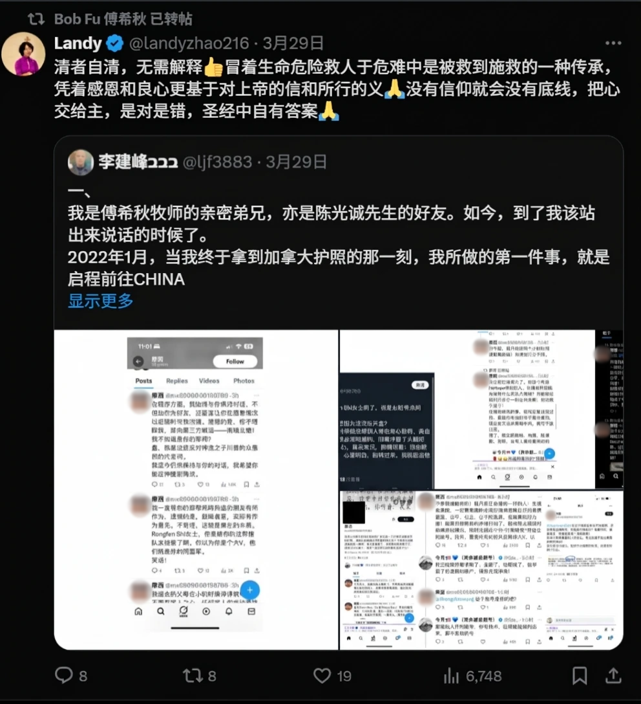

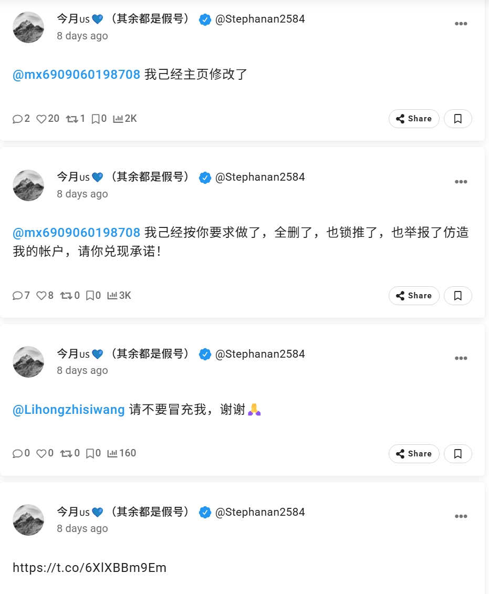

> 收到私信威胁，开道歉space以及按照加害者摩西要求删除推文和修改bio。

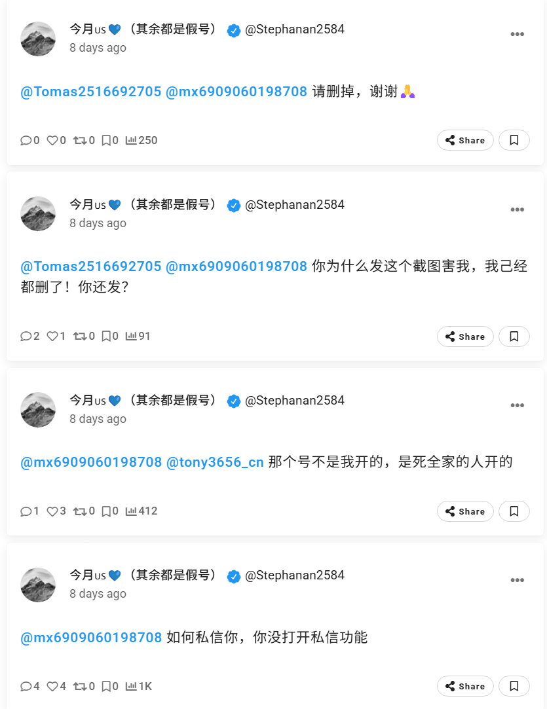

> 第一次加码，摩西指控今月开小号（userid：lihongzhisiwang），今月澄清。

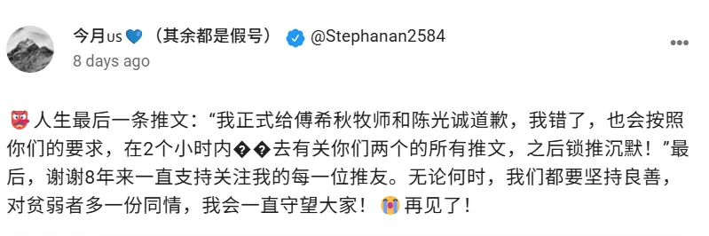

> 今月公开道歉并决定退网。

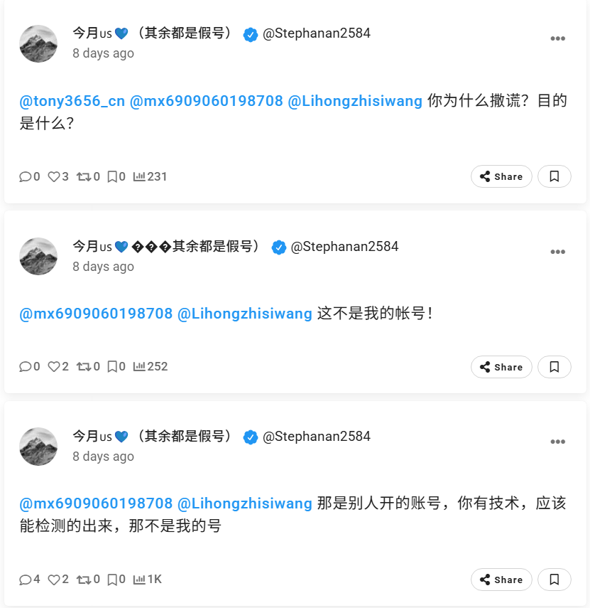

> 第二次加码，以小号名义继续曝光和威胁今月，今月继续向加害者摩西澄清。

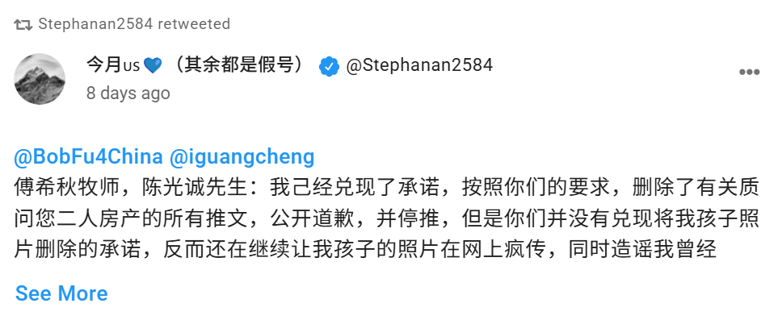

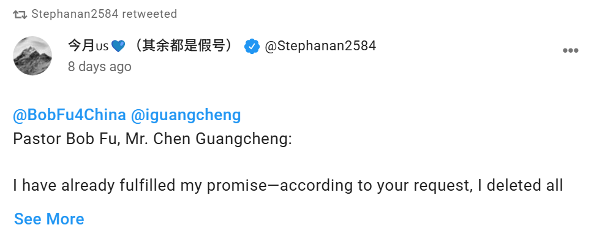

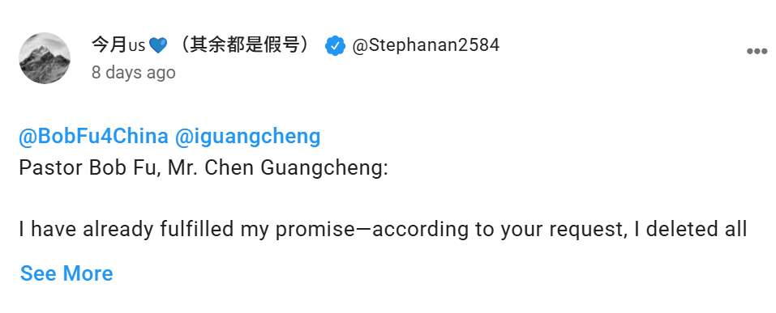

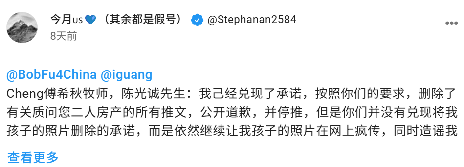

> 中英文喊话傅陈并两次转推。全文如下：
>
> @BobFu4China @iguangcheng @mx6909060198708
>
> 傅希秋牧师，陈光诚先生：
>
> 我已经兑现了承诺，按照你们的要求，删除了有关质问您二人房产的所有推文，公开道歉，并停推。但是你们并没有兑现将我孩子照片删除的承诺，反而还在继续让我孩子的照片在网上疯传，同时造谣我曾经作为郭蚂蚁去德州围攻你家。
>
> 我刚刚上网找了一下你家被围攻的时间（见图一），开始于2020年10月5日左右。那么请看一下（见图二），一篇我在2020年6月4日写的痛斥郭文贵的推文。我从2018年初就开始揭露文贵，为此遭遇蚂蚁帮的网暴，怎么可能在2020年去参与围攻你家？你如果非要说我去围攻你家了，请拿出证据。
>
> 请放过我的孩子，她才10岁，还没有成年。这么小的孩子，受不了这种事。另外，她也是一个虔诚的小基督徒，请你们放她一马，可以吗？
>
> 我知道那个摩西的帐号是你找来的，因为当我第一时间在消息栏发现第一篇威胁我的贴子的时候，您，傅希秋牧师是这个帐号的唯一关注者。又过了一段时间，陈光诚也关注这个号了！
>
> 《罗马书》12章17-21节（保罗的劝勉）：不要以恶报恶。众人以为美的事要留心去做。若是能行，总要尽力与众人和睦。亲爱的弟兄，不要自己伸冤，宁可让步，听凭主怒；因为经上记着：‘主说：伸冤在我，我必报应。’所以，‘你的仇敌若饿了，就给他吃；若渴了，就给他喝。因为你这样行，就是把炭火堆在他的头上。’你不可为恶所胜，反要以善胜恶。
>
> Pastor Bob Fu, Mr. Chen Guangcheng:
>
> I have already fulfilled my promise—according to your request, I deleted all tweets questioning your real estate holdings, issued a public apology, and stopped tweeting. However, you have not kept your promise to delete the photos of my child. On the contrary, her photos continue to circulate widely online, and now you are even spreading rumors that I, as a follower of Guo Wengui (Guo’s “ants”), went to Texas to attack your home.
>
> I just looked up the date your home was allegedly attacked (see image 1), and it began around October 5, 2020. Now please take a look (see image 2) at a tweet I wrote on June 4, 2020, denouncing Guo Wengui. I had already begun exposing Guo in early 2018, and I was subjected to cyberbullying by his followers for that. How could I have gone to attack your home in 2020? If you insist that I did, please provide evidence.
>
> Please leave my child alone. She is only 10 years old, still a minor. A child so young cannot handle this kind of situation. Moreover, she is a devout little Christian. Please show her mercy, will you?
>
> I know that the “Moses” account (@mx6909060198708) was someone you brought in, because when I first saw the threatening post in my notifications, you, Pastor Bob Fu (@BobFu4China), were the account’s only follower. Some time later, Mr. Chen Guangcheng (@iguangcheng) also followed that account.
>
> Romans 12:17–21 (Paul’s exhortation): Do not repay anyone evil for evil. Be careful to do what is right in the eyes of everyone. If it is possible, as far as it depends on you, live at peace with everyone. Do not take revenge, my dear friends, but leave room for God’s wrath, for it is written: “It is mine to avenge; I will repay,” says the Lord. On the contrary: “If your enemy is hungry, feed him; if he is thirsty, give him something to drink. In doing this, you will heap burning coals on his head.” Do not be overcome by evil, but overcome evil with good.

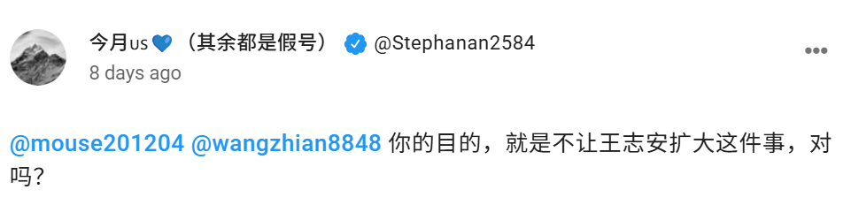

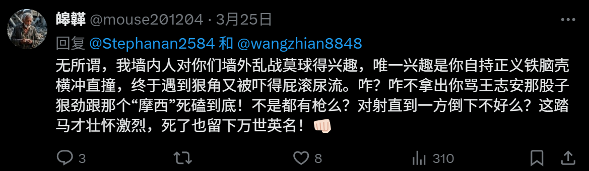

> 回复王志安粉丝的攻击

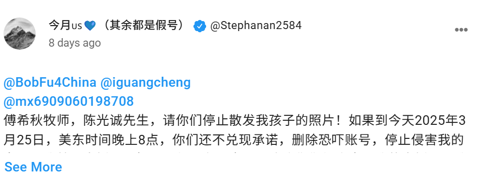

> 第二次喊话傅陈，仍未得到回应。
>
> @BobFu4China @iguangcheng @mx6909060198708
>
> 傅希秋牧师，陈光诚先生：
>
> 请你们停止散发我孩子的照片！如果到今天2025年3月25日美东时间晚上8点，你们还不兑现承诺，删除恐吓账号，停止侵害我的女儿，我就开直播了，把一切都晒在阳光下。欢迎你们俩个来到我的直播间，我们当面辩论。如果你有觉得你们两个房产信息中我有发布错的，我可以更正，因为查询不一定百分百准确，比如也许有贷款我没查到，请说明清楚就可以了！我可以更正。
>
> ---
>
> Pastor Bob Fu, Mr. Chen Guangcheng:
>
> Please stop distributing photos of my child! If by 8:00 PM Eastern Time on March 25, 2025, you still haven’t fulfilled your promise—deleting the threatening account and stopping the harm against my daughter—I will go live and expose everything in the sunlight. You are both welcome to join my livestream. Let’s debate face-to-face. If you believe there is any incorrect information in what I posted about your properties, I’m willing to make corrections. Property records are not always 100% accurate—for example, there might be a mortgage I didn’t find. Just clarify it, and I will correct it.

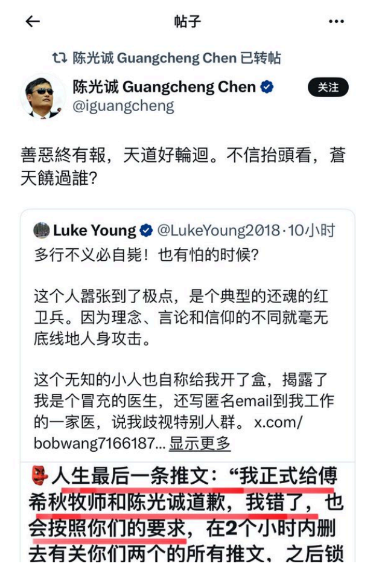

> 陈光诚转推记录

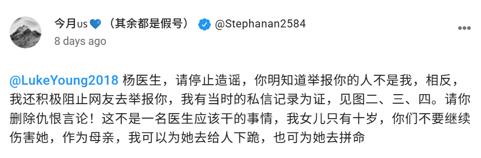

> 要求Luke Young停止造谣。
>
> @LukeYoung2018
>
> 杨医生，请停止造谣！你明知道举报你的人不是我，相反，我还积极阻止网友去举报你，我有当时的私信记录为证（见图二、三、四）。请你删除仇恨言论！这不是一名医生应该干的事情。我女儿只有十岁，你们不要继续伤害她。作为母亲，我可以为她去给人下跪，也可为她去拼命。
>
> Dr. Luke Young,
>
> Please stop spreading false accusations. You clearly know that I am not the one who reported you. On the contrary, I actively tried to stop others from reporting you. I have private message records as proof—see images 2, 3, and 4. Please delete your hateful remarks. This is not something a doctor should be doing. My daughter is only ten years old. Please stop hurting her. As her mother, I would kneel to others for her sake—or even risk my life for her.

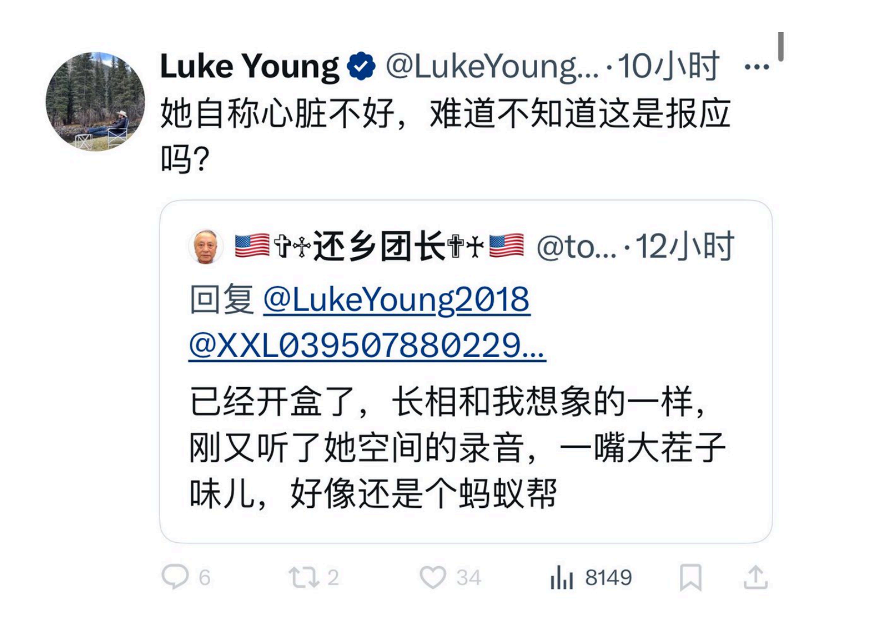

> Luke Young原帖

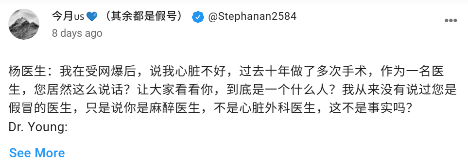

> 向造谣者Luke Young喊话，要求停止造谣，并第一次公开有心脏病史。全文如下：
>
> 杨医生：
>
> 我在受网暴后，说我心脏不好，过去十年做了多次手术，作为一名医生，您居然这么说话？让大家看看你，到底是一个什么人？我从来没有说过您是假冒的医生，只是说你是麻醉医生，不是心脏外科医生，这不是事实吗？
>
> Dr. Young:
>
> After I was cyberbullied, I mentioned that I have heart problems and have undergone multiple surgeries over the past ten years. And yet, as a doctor, you actually said what you did? Let everyone see what kind of person you really are. I have never said that you are a fake doctor. I simply stated that you are an anesthesiologist, not a cardiac surgeon—isn’t that a fact?

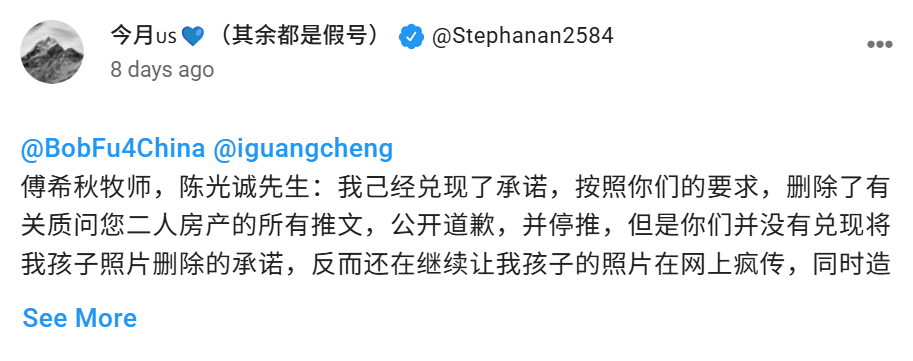

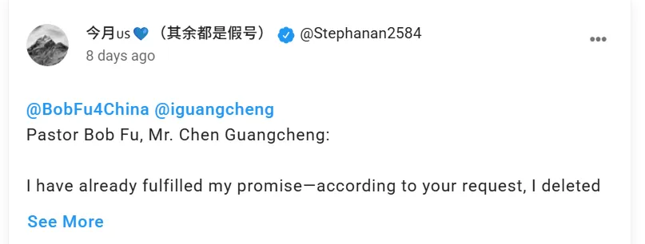

> 第三次喊话傅陈并两次转推。全文如下：
>
> @BobFu4China @iguangcheng @mx6909060198708
>
> 傅希秋牧师，陈光诚先生：
>
> 我已经兑现了承诺，按照你们的要求，删除了有关质问您二人房产的所有推文，公开道歉，并停推。但是你们并没有兑现将我孩子照片删除的承诺，反而还在继续让我孩子的照片在网上疯传，同时造谣我曾经作为郭蚂蚁去德州围攻你家。
>
> 我刚刚上网找了一下你家被围攻的时间（见图一），开始于2020年10月5日左右。那么请看一下（见图二），一篇我在2020年6月4日写的痛斥郭文贵的推文。我从2018年初就开始揭露文贵，为此遭遇蚂蚁帮的网暴，怎么可能在2020年去参与围攻你家？你如果非要说我去围攻你家了，请拿出证据。
>
> 请放过我的孩子，她才10岁，还没有成年。这么小的孩子，受不了这种事。另外，她也是一个虔诚的小基督徒，请你们放她一马，可以吗？
>
> 我知道那个摩西的帐号是你找来的，因为当我第一时间在消息栏发现第一篇威胁我的贴子的时候，您，傅希秋牧师是这个帐号的唯一关注者。又过了一段时间，陈光诚也关注这个号了！
>
> 《罗马书》12章17-21节（保罗的劝勉）：不要以恶报恶。众人以为美的事要留心去做。若是能行，总要尽力与众人和睦。亲爱的弟兄，不要自己伸冤，宁可让步，听凭主怒；因为经上记着：‘主说：伸冤在我，我必报应。’所以，‘你的仇敌若饿了，就给他吃；若渴了，就给他喝。因为你这样行，就是把炭火堆在他的头上。’你不可为恶所胜，反要以善胜恶。
>
> Pastor Bob Fu, Mr. Chen Guangcheng:
>
> I have already fulfilled my promise—according to your request, I deleted all tweets questioning your real estate holdings, issued a public apology, and stopped tweeting. However, you have not kept your promise to delete the photos of my child. On the contrary, her photos continue to circulate widely online, and now you are even spreading rumors that I, as a follower of Guo Wengui (Guo’s “ants”), went to Texas to attack your home.
>
> I just looked up the date your home was allegedly attacked (see image 1), and it began around October 5, 2020. Now please take a look (see image 2) at a tweet I wrote on June 4, 2020, denouncing Guo Wengui. I had already begun exposing Guo in early 2018, and I was subjected to cyberbullying by his followers for that. How could I have gone to attack your home in 2020? If you insist that I did, please provide evidence.
>
> Please leave my child alone. She is only 10 years old, still a minor. A child so young cannot handle this kind of situation. Moreover, she is a devout little Christian. Please show her mercy, will you?
>
> I know that the “Moses” account (@mx6909060198708) was someone you brought in, because when I first saw the threatening post in my notifications, you, Pastor Bob Fu (@BobFu4China), were the account’s only follower. Some time later, Mr. Chen Guangcheng (@iguangcheng) also followed that account.
>
> Romans 12:17–21 (Paul’s exhortation): Do not repay anyone evil for evil. Be careful to do what is right in the eyes of everyone. If it is possible, as far as it depends on you, live at peace with everyone. Do not take revenge, my dear friends, but leave room for God’s wrath, for it is written: “It is mine to avenge; I will repay,” says the Lord. On the contrary: “If your enemy is hungry, feed him; if he is thirsty, give him something to drink. In doing this, you will heap burning coals on his head.” Do not be overcome by evil, but overcome evil with good.

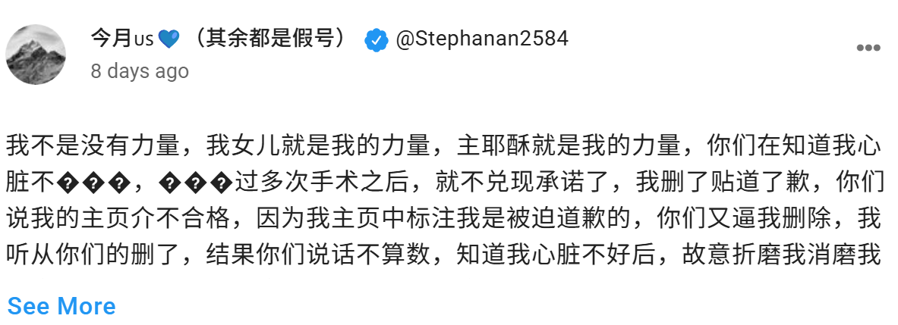

> 第二次提及心脏病史，并要求停止攻击。全文如下：
>
> 我不是没有力量，我女儿就是我的力量，主耶酥就是我的力量，你们在知道我心脏不好过多次手术之后，就不兑现承诺了，我删了贴道了歉，你们说我的主页介不合格，因为我主页中标注我是被迫道歉的，你们又逼我删除，我听从你们的删了，结果你们说话不算数，知道我心脏不好后，故意折磨我消磨我的意志，傅希秋牧师、陈光诚，杨医生，摩西，上帝在看着你们，希望你们及时改悔。

> 第四次喊话傅陈并两次转推。全文如下：
>
> @BobFu4China @iguangcheng @mx6909060198708
>
> Pastor Bob Fu, Mr. Chen Guangcheng:
>
> I have already fulfilled my promise—according to your request, I deleted all tweets questioning your real estate holdings, issued a public apology, and stopped tweeting. However, you have not kept your promise to delete the photos of my child. On the contrary, her photos continue to circulate widely online, and now you are even spreading rumors that I, as a follower of Guo Wengui (Guo’s “ants”), went to Texas to attack your home.
>
> I just looked up the date your home was allegedly attacked (see image 1), and it began around October 5, 2020. Now please take a look (see image 2) at a tweet I wrote on June 4, 2020, denouncing Guo Wengui. I had already begun exposing Guo in early 2018, and I was subjected to cyberbullying by his followers for that. How could I have gone to attack your home in 2020? If you insist that I did, please provide evidence.
>
> Please leave my child alone. She is only 10 years old, still a minor. A child so young cannot handle this kind of situation. Moreover, she is a devout little Christian. Please show her mercy, will you?
>
> I know that the “Moses” account (@mx6909060198708) was someone you brought in, because when I first saw the threatening post in my notifications, you, Pastor Bob Fu (@BobFu4China), were the account’s only follower. Some time later, Mr. Chen Guangcheng (@iguangcheng) also followed that account.
>
> Romans 12:17–21 (Paul’s exhortation): Do not repay anyone evil for evil. Be careful to do what is right in the eyes of everyone. If it is possible, as far as it depends on you, live at peace with everyone. Do not take revenge, my dear friends, but leave room for God’s wrath, for it is written: “It is mine to avenge; I will repay,” says the Lord. On the contrary: “If your enemy is hungry, feed him; if he is thirsty, give him something to drink. In doing this, you will heap burning coals on his head.” Do not be overcome by evil, but overcome evil with good.

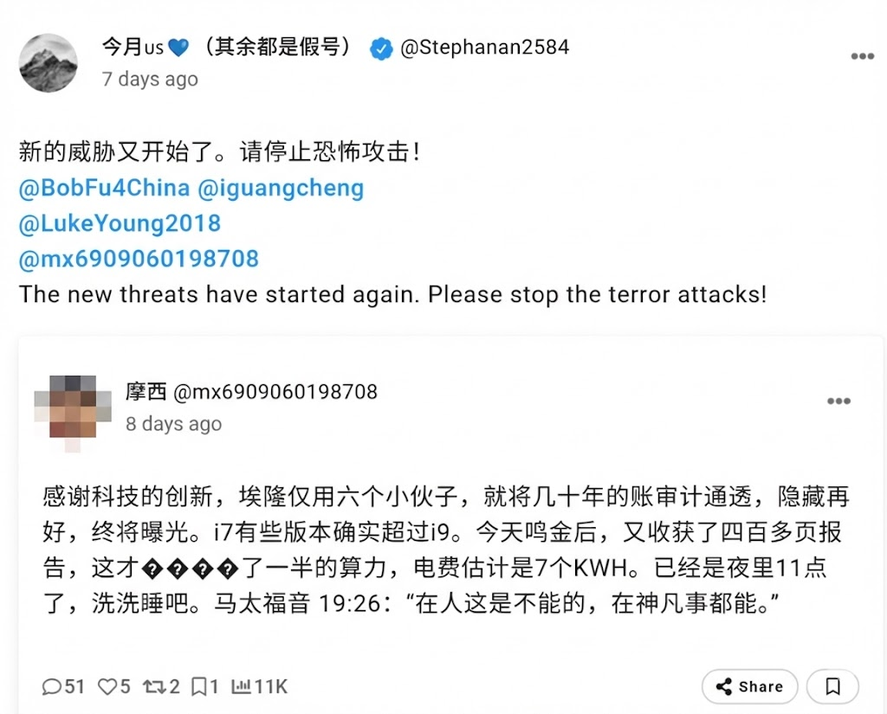

> 摩西第三次加码威吓。

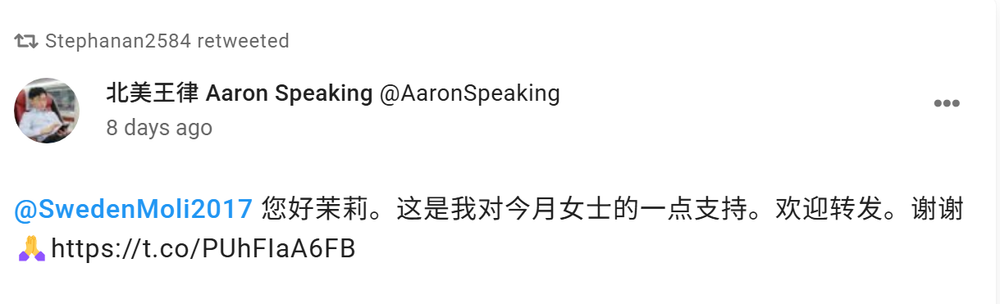

> 转发支持者推文。

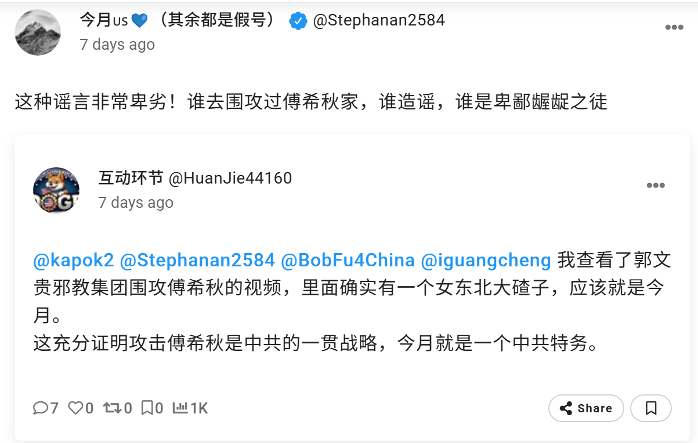

> 辟谣“蚂蚁”参与围攻傅希秋的谣言。

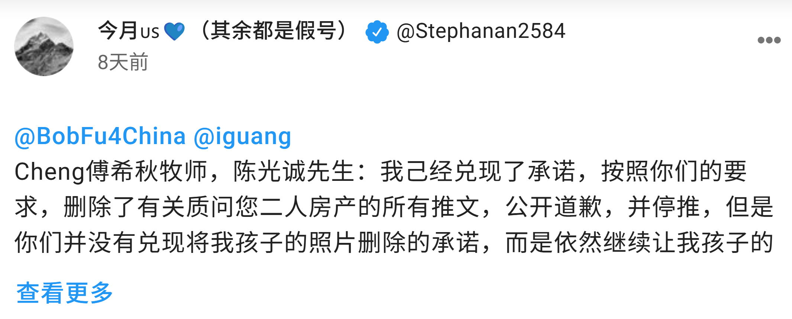

> 第五次喊话傅陈要求摩西停止加害 。

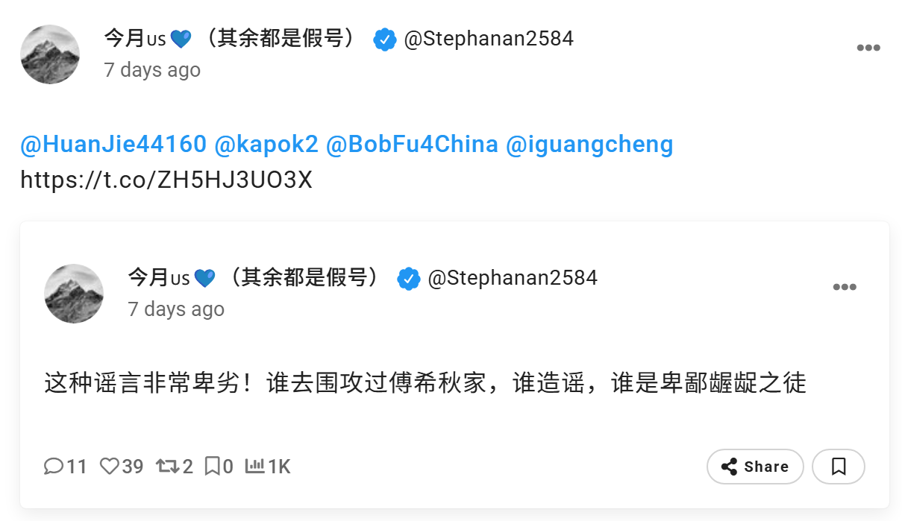

> 最后一条推特，驳斥自己作为“蚂蚁”参与围攻傅希秋的谣言。
