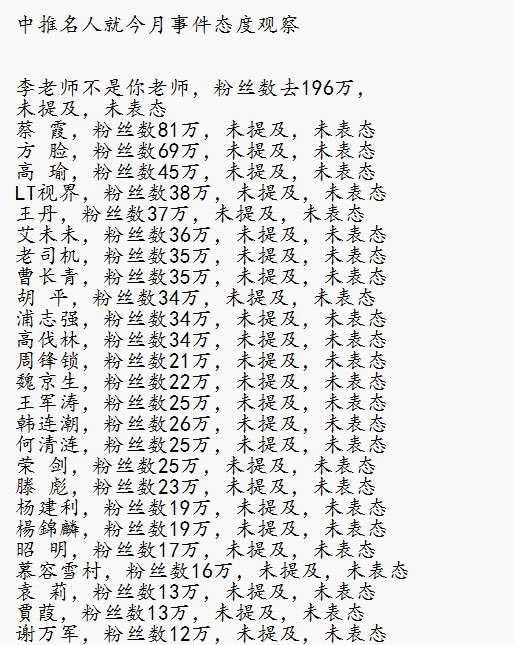
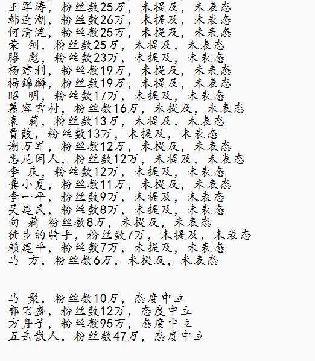
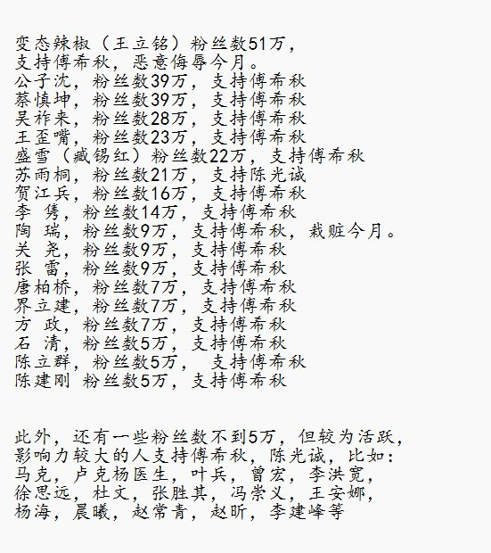
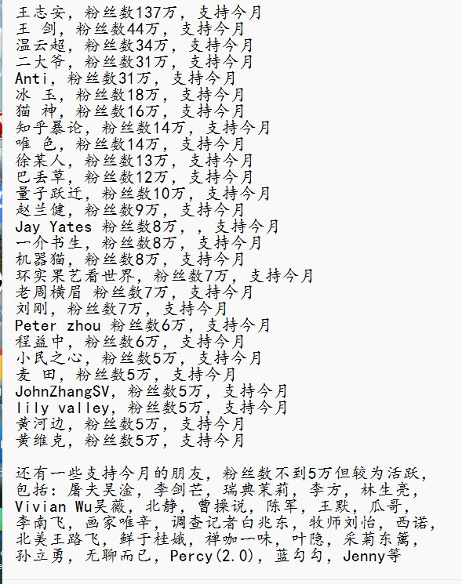

# 🔁 今月被网暴逼死事件华人知名人士态度观察名单

李少明 · 2025-03-30

原帖：https://x.com/dakache01/status/1906185366542925913

> **编者注**
>
> #### 网页评论一则
>
> > 千万不要忘记阶级斗争！\
> > 中国人，不斗行吗？\
> > 文攻武斗，针锋相对！\
> > 东风吹战鼓擂，这个世界上究竟谁怕谁！
>
> #### 李少明回复
>
> > 有人说我搞文革那一套，逼人表态。我解释一下，这只是我对他们在此事件上如何表态做一个观察，汇总。我没有也不会逼任何人表态，但是我有观察并记录这些名人们在这种重大的恶劣事件中如何表态的权利。
>
> 由此及彼，谈谈 cancel 文化，老中喜欢攻击 cancel 文化和政治正确是文革，但 cancel 不是无限追责。cancel 文化的一个隐含前提是：道德有重大瑕疵的人在受到相应惩罚和悔改前不配享有公众人物的光环，这是一种有限的暴力。上述名单是一种最弱版本的 cancel，或许都算不上。

今月被网暴逼死事件华人知名人士态度观察名单，3月30日晚间最新修改更正版。

我再次说明一下，个人精力和信息来源有限，名单永远不可能全面、总会有不周到之处，欢迎指出。

有一些朋友粉丝数没有达到我设置的5万界限，但是非常积极热心的为今月受害奔走，付出很多。但是我不能把每一个为今月发声的支持者都列进名单，如果都列进去恐怕可以写一本很厚的书了。

所以我想请这些朋友理解我，容量有限，本名单无法将今月的支持者全部罗列。

但是请相信我们并不孤单，也请相信我们的热情和付出绝不会白费，网络空间不再是少数大V行使网络霸权的时代，我们每一个普通人才代表真正的人心。

我希望和所有支持今月但是没有进入名单的朋友共勉。

